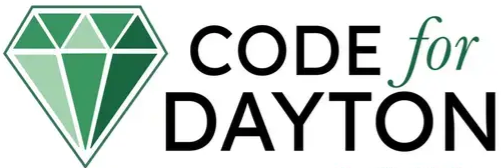
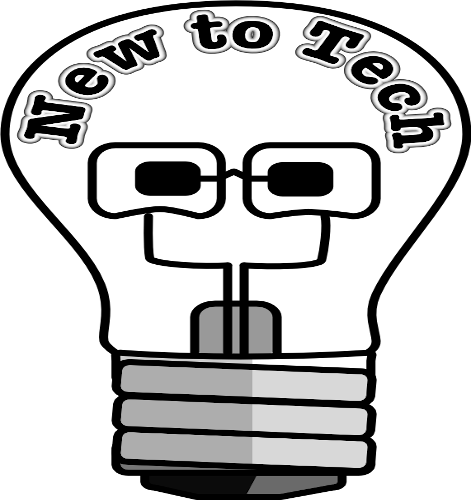
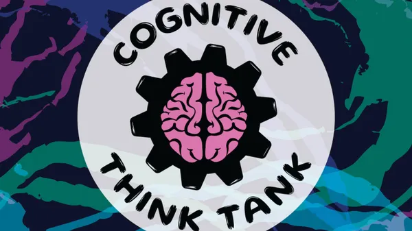
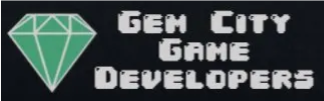
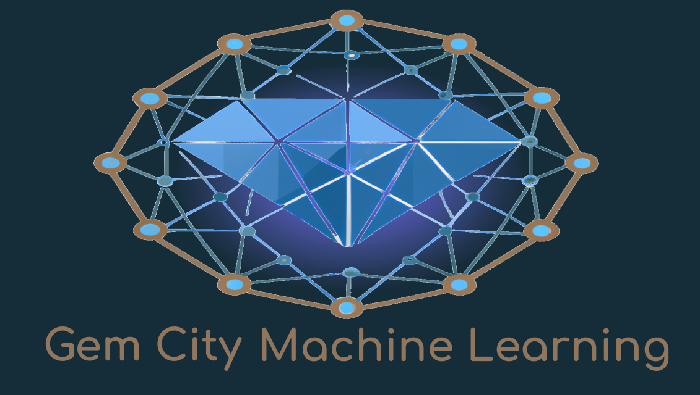

|  |  |  |
| :---: | :--------- | :---: |
| [{fig-pos='ht'}](https://www.codefordayton.org/) | **Code For Dayton** A monthly user group meeting that follows the "hack night" format - a little discussion and show and tell up front, followed by an opportunity to break into groups to work on civic or community oriented projects.|David Best  1st Tuesday @6pm |
|{fig-pos="center"} | **Software Engineering** (Formerly The Dayton Web Developers and .NET Developers user groups) - general topics around being a modern software, application, web or mobile developer | Hanen Alkhafaji, James, Carr &amp; Allen May   1st Wednesdays  and  2nd Tuesdays @6pm |
| {fig-valign="top"} | **New to Tech** - A public group focused on folks who are just starting to learn about software development, up through those already employed in the industry who are targeting their first promotion. Topics will be split between software development fundamentals & career guidance and there will be plenty of time for group discussion & live coding. Please bring your laptop!| Matt Alioto   1st Thursday @6pm  |
|  | **Cognitive Think Tank** _(VIRTUAL ONLY)_ - Our Mission is to get people thinking, share diverse perspectives, generate rich discussion in our community about the tools and techniques we are all using, and make connections with like minded professionals! _(This group meets online)_ | Layla Akilan, Damon Troncone   2nd Wednesdays @5pm |
|  | **Dayton Dynamic Languages** - Casual discussions and demonstrations that lean towards Ruby/Rails, Python/Django, Scheme, Lisp & Smalltalk | Catherine Devlin    2nd Wednesday @7pm |
|  | **Gem City Game Developers** - Exploring all topics around gaming and the gaming industry. We explore design, art, programming, digital and non-digital game topics. | Brian Turner   2nd Thursdays @5:30pm |
|  | **Gem City ML / AI** For professionals who are curious about machine learning and meeting with like minded professionals. | Evelyn J. Boettcher   3rd Thursdays @6pm   |